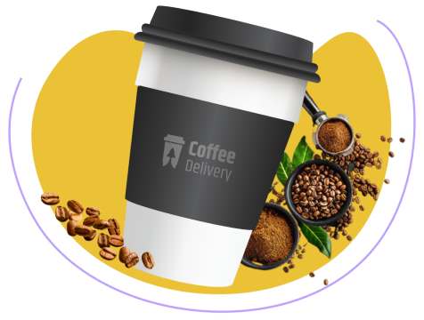
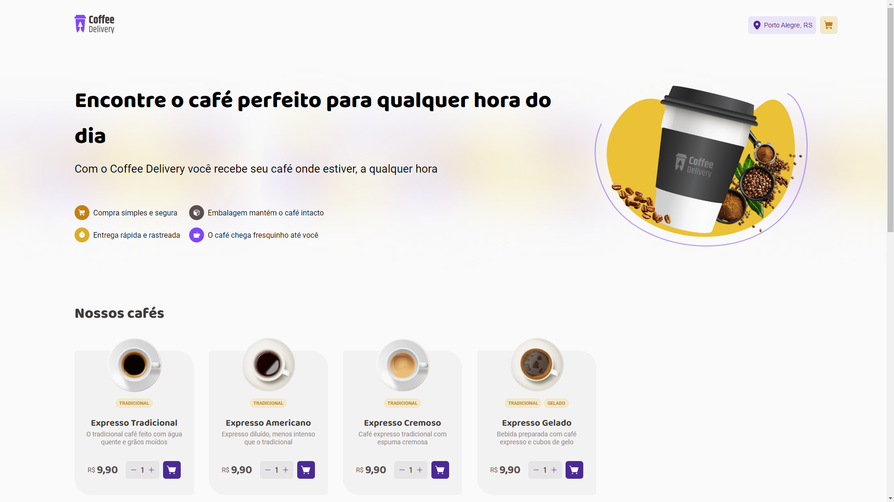

<div align="center"> 


<h1> Coffee Delivery</h1>


[](https://app.netlify.com/sites/ignite-02-coffee-delivery/deploys)
<h4 align="center"> 
	🚧  React Select 🚀 Em construção...  🚧
</h4>
</div>

## Sobre o projeto

O Coffee-Delivery é um projeto e desafio 02 desenvolvido no curso **Ignite Rocketseat**.

Neste foi proposto utilizando as seguintes funcionalidades:
- Listagem de produtos (cafés) disponíveis para compra, consumindo uma API;
- Adicionar uma quantidade específicas de itens no carrinho;
- Aumentar ou remover a quantidade de itens no carrinho;
- Formulário para o usuário preencher o seu endereço;
- Exibir o total de itens no carrinho no Header;
- Exibir o valor total da soma de itens no carrinho multiplicados pelo valor;

<div align="center"> 

<a href="https://ignite-02-coffee-delivery.netlify.app/"> 
<p>Projeto Publicado</p></a>

<a href="https://www.figma.com/file/5yT9ZzZmRQRS4yivGGB3pl/Coffee-Delivery/duplicate"> 
<p>Projeto no Figma</p></a>
</div>

## Layout web desenvolvido


## Tecnologias utilizadas
- [TypeScript](https://www.typescriptlang.org/)
- [React](https://pt-br.reactjs.org/)
- [Vite](https://vitejs.dev/)
- [phosphor-icons](https://phosphoricons.com/)
- [zod](https://zod.dev/)
- [Styled-components](https://styled-components.com/)

## Funcionalidades
- Estados;
- Imutabilidade do estado;
- Listas e chaves no ReactJS;
- Propriedades;
- Componentização;
- ContextAPI;
- LocalStorage ;

# Como executar o projeto

Pré-requisitos: NODE e npm

```bash
# clonar repositório
git clone https://github.com/Paulohbarbosa/02-coffee-delivery.git 

# entrar na pasta do projeto raiz e instale as dependências
npm install

# executar o projeto, em seguida clique no endereço que foi exibido no seu promt
npm rum dev
```
### Autor

<a href="https://github.com/Paulohbarbosa">
 
 <br />
 <sub><b>Paulo Barbosa</b></sub></a> <a href="https://github.com/Paulohbarbosa" >🚀</a>


Feito com ❤️ por Paulo Barbosa 👋🏽 Entre em contato!

[](https://www.linkedin.com/in/paulo-henrique-barbosa-495492160/) 
[](mailto:paulobarbosah.ph@gmail.com)
